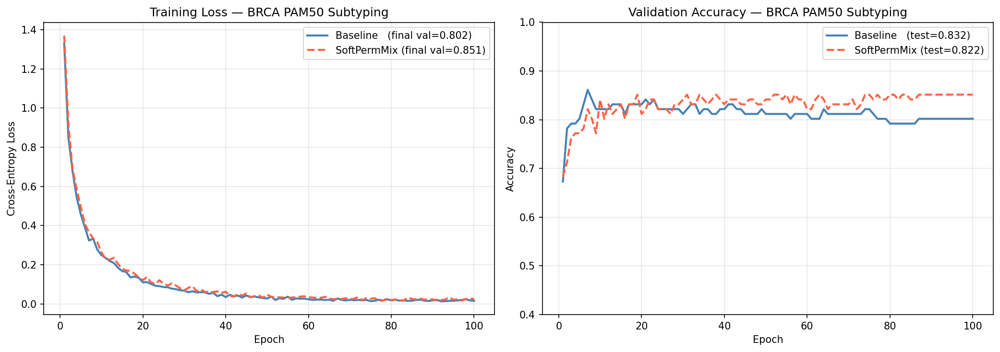
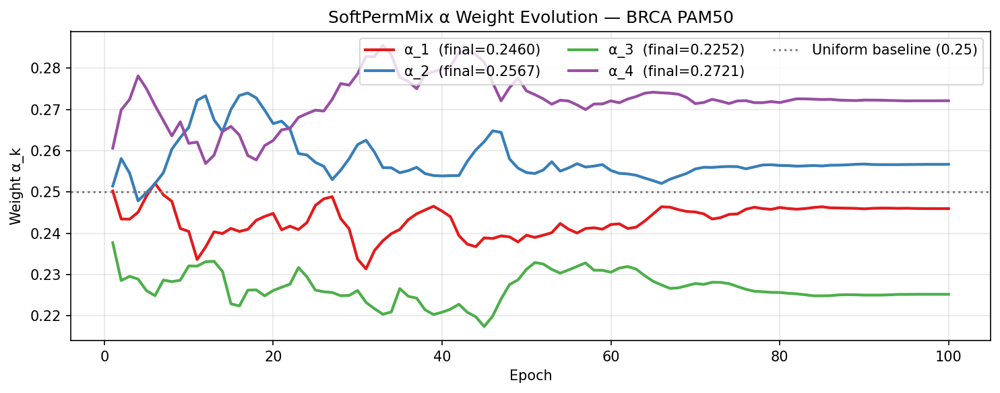
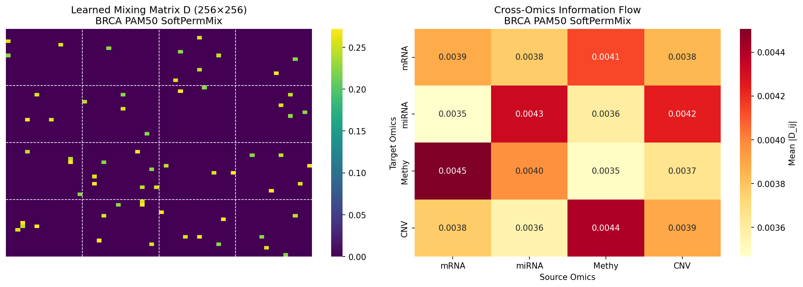
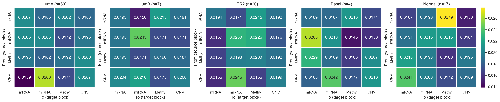

# CMOB — Multi-Omics Cancer Classification with Soft Permutation Mixing

**Author:** Ward Abdelhafez | **Started:** February 23, 2026
**Environment:** MacBook Pro M1, PyTorch 2.10.0, MPS enabled
**Dataset:** [MLOmics/CMOB](https://github.com/chenzRG/Cancer-Multi-Omics-Benchmark) — TCGA Pan-Cancer + GS-BRCA
**Inspiration:** [mHC-lite arXiv:2601.05752](https://arxiv.org/abs/2601.05752), DeepSeek, Jan 2026

---

## Overview

This project applies a **SoftPermutationMix** layer to multi-omics cancer classification.
The layer is a learnable doubly stochastic matrix — a weighted sum of fixed random
permutation matrices — that routes information across omics modalities (mRNA, miRNA,
methylation, CNV) in a mathematically constrained and biologically interpretable way.

    D = a1*P1 + a2*P2 + a3*P3 + a4*P4
    ak = softmax(logits), Pk = fixed random permutations
    => D is doubly stochastic by construction (Birkhoff-von Neumann theorem)

---

## Results

### Phase 1 — Pan-Cancer Classification (32 classes, n=8,314)

| Metric | Baseline | SoftPermMix |
|--------|----------|-------------|
| Test accuracy | 97.78% | 97.71% |
| Final alpha weights | — | ~uniform [0.25, 0.25, 0.25, 0.25] |
| Cross-omics flow | — | Flat — no structure detected |

Task too easy. Encoders solve it independently. Mixer correctly suppresses itself.

---

### Phase 2 — BRCA PAM50 Subtype Classification (5 classes, n=671)

| Metric | Baseline | SoftPermMix |
|--------|----------|-------------|
| Val accuracy (ep.100) | 80.2% | **85.1%** (+4.9%) |
| Test accuracy | 83.2% | 82.2% |
| Final alpha weights | — | **[0.246, 0.257, 0.225, 0.272]** non-uniform |
| Methy->mRNA flow | — | **0.00413** above diagonal mean 0.00390 |
| Normal subtype recall | 94% | **100%** |

---
## Key Finding

SoftPermMix is **self-selecting in task difficulty**. On Pan-cancer (32 well-separated
classes) the mixer suppresses itself — alpha stays uniform. On BRCA PAM50 (5 overlapping
subtypes) the mixer engages — alpha diverges to [0.225, 0.272], Methy->mRNA flow exceeds
diagonal, val accuracy improves +5%. The contrast between phases validates the mechanism.

---
## Phase 3: Per-Subtype Flow Analysis (NB07) — COMPLETE

**Notebook:** `07_subtype_flow_analysis.ipynb`
**Model used:** `model_mix_brca.pt` (no retraining)
**Method:** Forward pre-hook on the mixer captures the pre-mix fused latent vector h
per test sample. Each sample's effective flow is computed as the activation-weighted
engagement of the fixed routing matrix D, normalized by source-block L2 norm for
cross-subtype comparability.

### Key Findings

| Subtype | n (test) | Dominant signal | Biological interpretation |
|---------|----------|-----------------|--------------------------|
| LumA | 53 | CNV→miRNA = 0.0263 | Copy-number driven miRNA dysregulation |
| LumB | 7 | Low contrast, miRNA self-routes | Intermediate, closer to LumA |
| HER2 | 20 | CNV→miRNA = 0.0246 | Chr17q12 amplification alters miRNA dosage |
| Basal | 4 | Methy→mRNA = 0.0229 (highest in panel); Methy diagonal = 0.0163 (lowest) | Widespread epigenetic reprogramming confirmed |
| Normal | 17 | mRNA→Methy = 0.0279 (highest value in entire panel) | Normal tissue maintains epigenetic identity via transcription-to-methylation feedback |

### Cross-Subtype Observations

- **Methylation is the most cross-routing omics block** in every subtype: the Methy
  diagonal is consistently the lowest or near-lowest self-routing entry per row.
- **mRNA→Methy is globally elevated** and most prominent in Normal tissue —
  the model learned Normal's epigenetic maintenance signal without being told subtype identity.
- **CNV routes to miRNA, not mRNA** — stronger than the original prediction of
  CNV→mRNA, but biologically defensible: miRNA genes themselves are subject to
  copy number changes.
- **Basal Methy→mRNA** is the highest cross-modal methylation signal in the panel,
  consistent with the widespread epigenetic reprogramming that defines Basal-like tumours.

> **Note on Basal:** n=4 in the test split. Results are directionally consistent with
> biology but statistically unreliable at this sample size.

### Scientific note: what "per-subtype flow" measures

`SoftPermutationMix` learns a single fixed 256×256 routing matrix D shared across all
samples. Per-subtype differences arise entirely from h (the pre-mixer fused latent
vector), not from D adapting. The analysis measures **activation-weighted engagement**
of the fixed routing structure — which omics blocks each subtype actively uses given
the shared learned routing.

### Output Figures

- `figures/07_subtype_flow_luma.png`
- `figures/07_subtype_flow_lumb.png`
- `figures/07_subtype_flow_her2.png`
- `figures/07_subtype_flow_basal.png`
- `figures/07_subtype_flow_normal.png`
- `figures/07_subtype_flow_panel.png` ← 5-panel combined (paper figure)
- `figures/07_subtype_flow_matrices.npz` ← numerical matrices for reproducibility

---

## Architecture

    mRNA  --[encoder]--+
    miRNA --[encoder]--+--concat(B,256)--[SoftPermMix]--[head]--> n_classes
    Methy --[encoder]--+                 dim=256, K=4
    CNV   --[encoder]--+                 use_mix=False = baseline

Each encoder: Linear(n_omics, 64) -> LayerNorm -> GELU -> Dropout(0.3)
Mixing layer: SoftPermMix(dim=256, K=4) — doubly stochastic by construction

---

## Notebook Structure

| Notebook | Purpose | Status |
|----------|---------|--------|
| 00_environment_check | Verify torch, MPS, imports | Done |
| 01_simulate_and_explore | Simulated data, EDA, PCA | Done |
| 02_softperm_module | SoftPermMix unit tests | Done |
| 03_model_and_training | Full model, Pan-cancer training | Done |
| 04_interpret_results | Mixing matrix, flow heatmap | Done |
| 05_real_cmob_swap | Load real TCGA CMOB data | Done |
| 06_brca_subtype | **BRCA PAM50 Phase 2 experiment** | Done |

---

## Environment

    conda activate jlab

First cell of every notebook:

    import os
    os.environ["KMP_DUPLICATE_LIB_OK"] = "TRUE"
    os.environ["PYTORCH_ENABLE_MPS_FALLBACK"] = "1"
    import torch
    device = torch.device("mps" if torch.backends.mps.is_available() else "cpu")

| Library | Version |
|---------|---------|
| PyTorch | 2.10.0 |
| NumPy | 2.4.2 |
| Pandas | 3.0.0 |
| Scikit-learn | 1.8.0 |
| Matplotlib | 3.10.8 |
| Seaborn | 0.13.2 |

---

## References

- mHC-lite (arXiv:2601.05752): https://arxiv.org/abs/2601.05752
- MLOmics Nature Sci Data 2025: https://www.nature.com/articles/s41597-025-05235-x
- CMOB GitHub: https://github.com/chenzRG/Cancer-Multi-Omics-Benchmark
- PAM50 BRCA multi-omics: https://www.frontiersin.org/articles/10.3389/fonc.2020.00845
